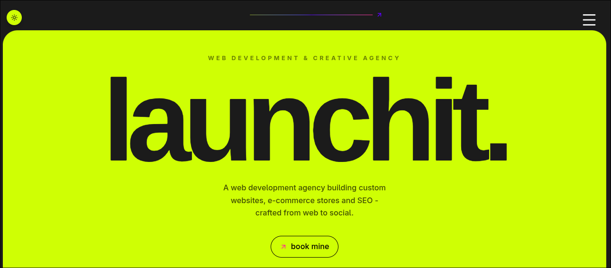
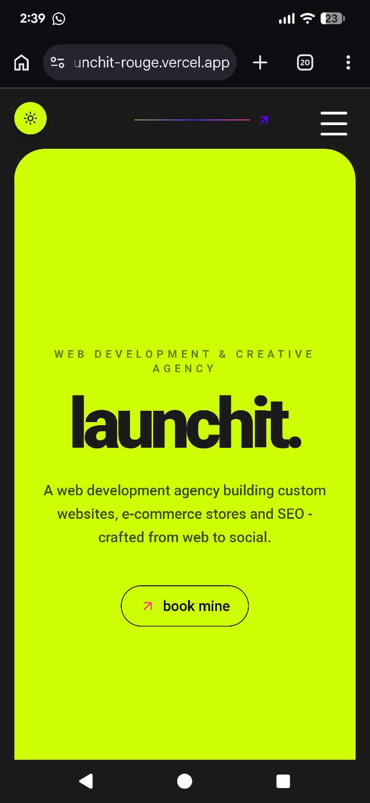
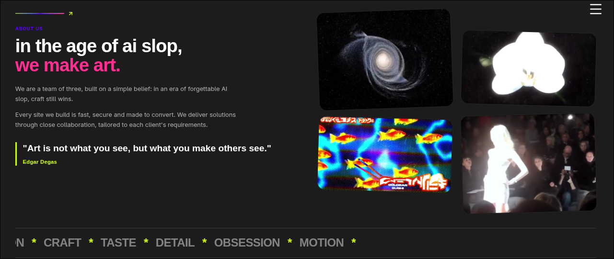
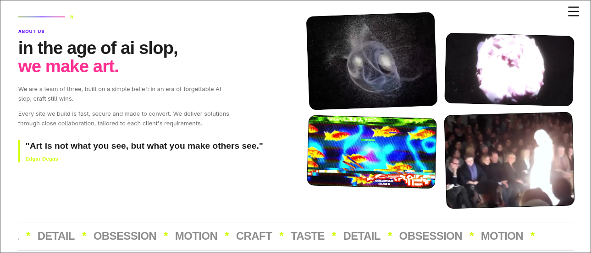
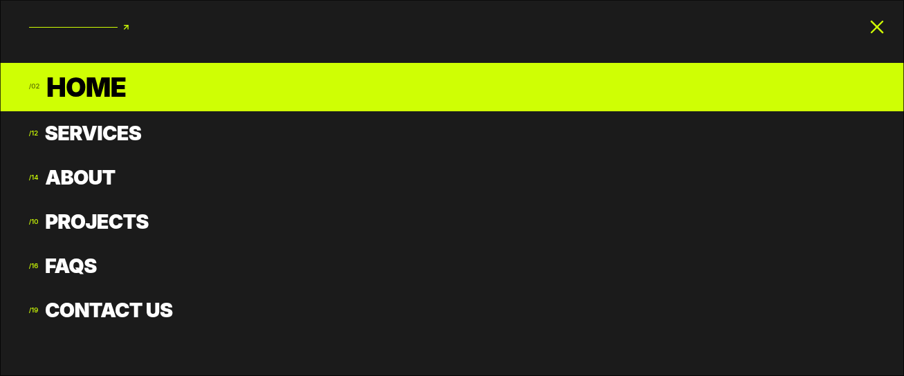
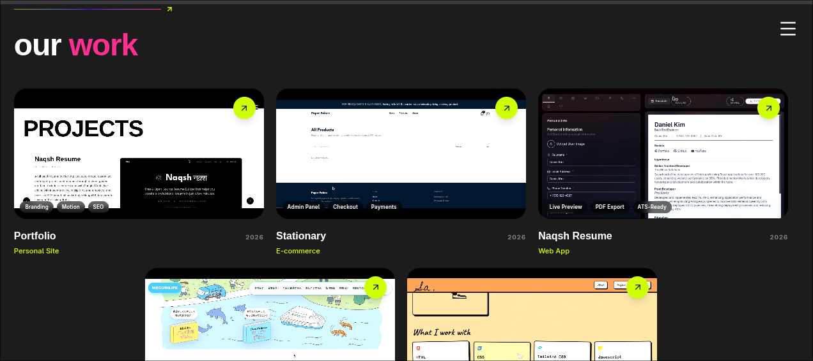

# launchit.

The website for **launchit**, a creative agency that builds brand presence from the ground up, web development, e-commerce, portfolios, social media management, and SEO, all under one roof.

---

## Features that makes it cool
- It's fully responsive for phones n big screens
- I love the colors
- has light and dark mode (coz there are some impostors who actually cant use dark mode)
- Blogs that for SEO purposes
- Cool videos (from pinterest yes they mentioned they are free to use)
- Made for beest.hackclub.com 


## Tech stack

- **React 19** with **TypeScript**
- **Vite** for dev server and builds
- **Tailwind CSS** for styling
- **Framer Motion** for scroll-triggered and interactive animation
- **Lucide React** for icons (kept consistent across the whole site, no mixing icon libraries)


---

## Design system

The whole site runs on five colors and one typeface. That's intentional, restraint is the point.

| Name          | Hex       | Used for                                  |
|---------------|-----------|--------------------------------------------|
| Graphite Black| `#1C1C1C` | Base background everywhere                |
| White         | `#FFFFFF` | Primary text on dark backgrounds          |
| Lime          | `#CFFF04` | Primary accent, CTAs, active states       |
| Pink          | `#FF2E91` | Secondary accent, highlights              |
| Indigo        | `#5D00FF` | Tertiary accent, used sparingly           |

---

## Project structure

```
src/
├── assets/              # Videos, images, poster frames for lazy video loading
├── sections/            # One file per homepage section (Hero, Services, About, Projects, FAQ, Connect, Footer)
├── pages/                # Full routed pages (ServicesPage, etc.)
├── utils.ts              # Shared constants: EASE curve, shared data
├── App.tsx                # Router setup
└── main.tsx                # Entry point
```
My personal fav part of this project is the about section I think its really cool 
---

## Getting started

**Requirements:** Node 18+ and npm (or pnpm/yarn if you prefer, just adjust the commands).

```bash
# install dependencies
npm install

# start the dev server
npm run dev

# build for production
npm run build

# preview the production build locally
npm run preview
```

---

## Also the Emailjs wont work now coz we did not buy the domain name yet :3


## A note on the videos

A few sections (About, Projects) use looping background video instead of static images, I took these videos from pinterest (their description said free to use :3)

## Some cool screenshots


(mobile preview)





## License
Free to use and make changes:3 